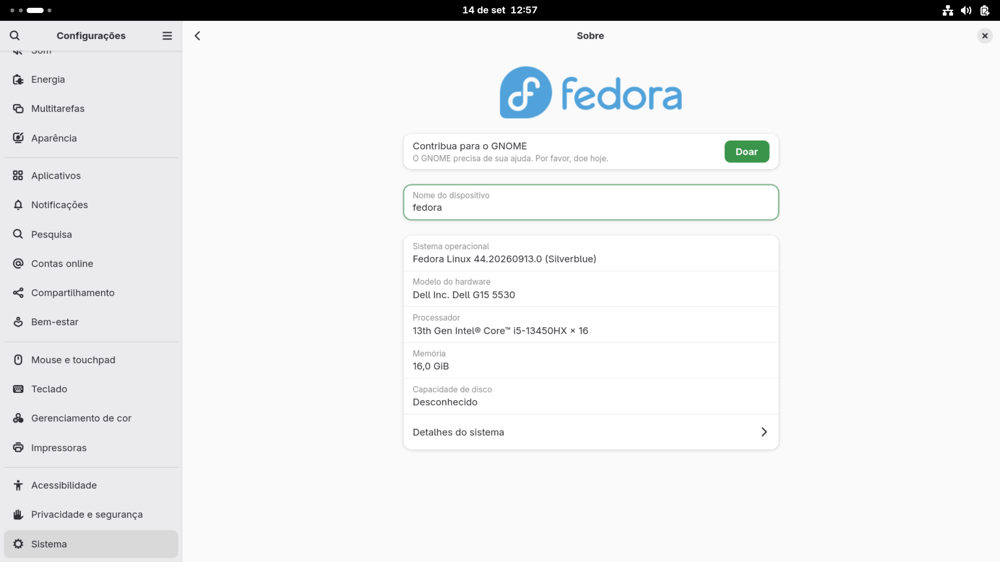

A imagem cobre uma necessidade de uso do Fedora Silverblue com o módulo [OpenRM](https://open-iov.org/index.php/OpenRM) da NVIDIA integrado sem recorrer a distibuições do ublue. Além de disponibilizar o módulo Open Source, há suporte para versões do módulo da NVIDIA legado (totalmente proprietário).
A tecnologia usada para fabricação é o [bootc](https://github.com/bootc-dev/bootc), que possibilita atualizações transacionais que substituem atomicamente a imagem do sistema ao invés de pacotes individuais. O bootc usa containeres bootáveis em conjunto com o OSTree para possibilitar isso.



# Variantes disponíveis

* `fedora-silverblue-bootc-custom-nvidia-open` que inclui a stack proprietária de NVIDIA para GPUs da série 16xx e acima (Turing+). [📦Containerfile](https://github.com/ramonmsilvabr/fedora-silverblue-bootc-custom/blob/main/builds/nvidia-open/Containerfile)
* `fedora-silverblue-bootc-custom-nvidia-legacy-580xx` que inclui a stack proprietária da NVIDIA para GPUs da série 10xx, 9xx e 8xx (Maxwell, Pascal e Volta). [📦Containerfile](https://github.com/ramonmsilvabr/fedora-silverblue-bootc-custom/blob/main/builds/nvidia-legacy-580xx/Containerfile)
* (DESCONTINUADO POR HORA)`fedora-silverblue-bootc-custom` apenas inclui os drivers Open Source. [📦Containerfile](https://github.com/ramonmsilvabr/fedora-silverblue-bootc-custom/blob/main/builds/default/Containerfile)

# Requisitos de hardware

Para as variantes NVIDIA, é necessário que você tenha uma GPU da fabricante correspondente.
* Pelo menos uma GPU Maxwell (GeForce GTX 8xx) para a edição Legacy.
* Pelo menos uma GPU Turing (GeForce RTX 20xx) para a edição Open.

Para as variantes Open Source, os requisitos são idênticos a uma edição oficial do
* Processador dual core de 2 GHz ou mais rápido
* Memória RAM do sistema de 2 GB
* 15 GB de espaço em disco não alocado

# Canais de atualização

As versões vão sendo alteradas na medida que o upstream do Fedora disponibiliza novas versões estáveis da distribuição.

Para referência mais atual, as versões são disponibilizadas assim:
|Canal|Versão atual|Recorrência de build|
|---|---|---|
|latest|44|Diária||
|beta|45|Ocasional|
|old|43|Ocasional|

# Baterias inclusas

Módulos de kernel extras:
* `nvidia`, `nvidia-drm`, `nvidia-uvm`, `nvidia-modeset`: Drivers da NVIDIA

Ambiente Desktop: GNOME Shell 50.x

Compositor Wayland: Mutter 50.x 

Imagem base: [Fedora Silverblue](https://quay.io/repository/fedora/fedora-silverblue)

# Buildar imagem localmente

* Escolha uma das edições dentro do builds/*, clone o repositório e crie um container podman com a imagem

```
git clone https://github.com/ramonmsilvabr/fedora-silverblue-bootc-custom.git
cd fedora-silverblue-bootc-custom
sudo podman build --build-arg SECUREBOOT_IGNORE=true -t fedora-silverblue-bootc-custom-x . -f builds/<edição escolhida>/Containerfile
```

* Faça o `switch` para a imagem no host se você já estiver numa distro ostree: 

```
   sudo bootc switch localhost/fedora-silverblue-bootc-custom-x
```

* Se você não estiver numa distribuição OSTree, instale a partir da geração de ISO:

```
sudo podman run \
    --rm \
    -it \
    --privileged \
    --pull=newer \
    --security-opt label=type:unconfined_t \
    -v ./output:/output \
    -v ./iso/config.toml:/config.toml:ro \
    -v /var/lib/containers/storage:/var/lib/containers/storage \
    quay.io/centos-bootc/bootc-image-builder:latest \
    --type anaconda-iso \
    --rootfs btrfs \
    localhost/fedora-silverblue-bootc-custom-x
```

# Uso da imagem no registro do Github Actions

* Se você usa Secure Boot, importe o certificado antes de instalar,defina uma senha de sua preferência no mokutil:
    ```
    git clone https://github.com/ramonmsilvabr/fedora-silverblue-bootc-custom.git
    cd fedora-silverblue-bootc-custom/scripts/secureboot
    sudo mokutil -i MOK.der
    ```

* Separo em três canais, o canal **latest**  possui a última versão estável do Fedora, o **beta** possui a próxima versão e o **old** possui a versão que está ainda sendo suportada sem ser a mais atual. Se você preferir, você pode escolher uma versão específica por número: ex. 44, 45 e 43.

* Se você quer gerar uma ISO, utilize o bootc-image-builder numa distro do Fedora ou derivados (CentOS e RHEL).

    * Variante `nvidia-open`:
    
    ```
    sudo podman run \
        --rm \
        -it \
        --privileged \
        --pull=newer \
        --security-opt label=type:unconfined_t \
        -v ./output:/output \
        -v ./config.toml:/config.toml:ro \
        -v /var/lib/containers/storage:/var/lib/containers/storage \
        quay.io/centos-bootc/bootc-image-builder:latest \
        --type anaconda-iso \
        --rootfs btrfs \
        ghcr.io/ramonmsilvabr/fedora-silverblue-bootc-custom-nvidia-open:<versão>
    ```
    * Variante `nvidia-legacy-580xx`:
    ```
    sudo podman run \
        --rm \
        -it \
        --privileged \
        --pull=newer \
        --security-opt label=type:unconfined_t \
        -v ./output:/output \
        -v ./config.toml:/config.toml:ro \
        -v /var/lib/containers/storage:/var/lib/containers/storage \
        quay.io/centos-bootc/bootc-image-builder:latest \
        --type anaconda-iso \
        --rootfs btrfs \
        ghcr.io/ramonmsilvabr/fedora-silverblue-bootc-custom-nvidia-legacy-580xx:<versão>
    ```
    * Variante `Open Source`:
    ```
    sudo podman run \
        --rm \
        -it \
        --privileged \
        --pull=newer \
        --security-opt label=type:unconfined_t \
        -v ./output:/output \
        -v ./config.toml:/config.toml:ro \
        -v /var/lib/containers/storage:/var/lib/containers/storage \
        quay.io/centos-bootc/bootc-image-builder:latest \
        --type anaconda-iso \
        --rootfs btrfs \
        ghcr.io/ramonmsilvabr/fedora-silverblue-bootc-custom:<versão>
    ```

* Se você já estiver em qualquer edição atômica do Fedora ou derivados, você pode puxar a imagem direto do registro.

    ```
    sudo bootc switch ghcr.io/ramonmsilvabr/fedora-silverblue-bootc-custom-nvidia-open:<versão>
    ```

    ```
    sudo bootc switch ghcr.io/ramonmsilvabr/fedora-silverblue-bootc-custom-nvidia-legacy-580xx:<versão>
    ```
    
    ```
    sudo bootc switch ghcr.io/ramonmsilvabr/fedora-silverblue-bootc-custom:<versão>
    ```


# Créditos e licenciamento

Agradecimentos a comunidade do Fedora, do bootc e [Fernando Fedora](https://github.com/Ferlinuxdebian) pela ajuda com o projeto.

Se você precisar, pode utilizar o código disponibilizado aqui livremente sem restrições.
